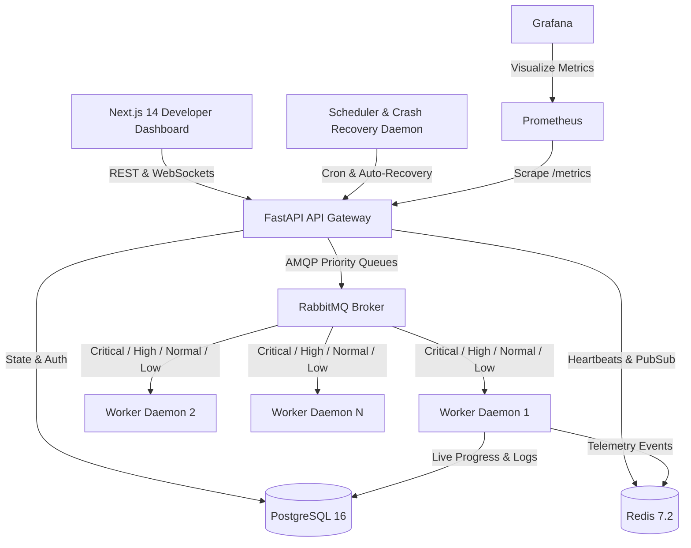

# FlowForge: Distributed Job Processing & Workflow Orchestration Platform

FlowForge is a production-grade distributed job processing, scheduling, and workflow orchestration platform combining the asynchronous execution power of Celery, the DAG workflow intelligence of Temporal, and a modern developer telemetry dashboard.

---

## Architecture Overview



---

## Key Features

### 1. Multi-Tier Priority Message Broker
- RabbitMQ AMQP broker with 4 priority tiers (`CRITICAL`, `HIGH`, `NORMAL`, `LOW`) and 0-10 priority weighting.
- Dead Letter Exchange (`flowforge.dlx`) and dedicated Dead Letter Queue (`queue.dlq`).
- Zero-dependency embedded priority fallback broker for instant local development and test execution.

### 2. Autonomous Distributed Worker Fleet
- Worker daemons with real-time CPU/RAM telemetry, active concurrency management, and periodic heartbeats.
- Built-in task execution handlers:
  - **CPU Computation:** Prime calculation and matrix multiplication with progress checkpoints.
  - **I/O Simulation:** Multi-chunk external requests with simulated latencies.
  - **Data Processing:** Large JSON record ETL transformation, validation, and checksum calculation.
  - **Image Transformation:** Simulated resizing, blurring, watermarking, and compression.
  - **Report Generation:** Executive PDF/CSV report compiler.
  - **Failure Simulation:** Configurable failure thresholds for testing retry backoff and DLQ behavior.
  - **Sleep / Delay:** Concurrency stress workloads.

### 3. DAG Workflow Orchestration Engine
- Construct complex multi-step pipelines with Sequential, Parallel, and Conditional execution branches.
- Cycle prevention via Kahn's algorithm and topological level resolver.
- Real-time step status visualization and context data propagation between nodes.

### 4. Fault Tolerance, Retries & Chaos Engineering Lab
- Configurable retry policies with Exponential Backoff, Fixed, and Linear strategies + Jitter.
- Classification of transient vs fatal non-retryable errors.
- Automatic orphaned job recovery when worker crashes are detected.
- Built-in Chaos Lab to inject worker kills, latency, and queue floods.

---

## Benchmark Results (Measured)

```
==================================================
   FLOWFORGE LOAD TEST BENCHMARK (1,000 JOBS)
==================================================
Total Submission Time: 8.914 s
Throughput:            112.2 jobs/sec
Avg Latency:           8.91 ms
P50 Latency:           8.34 ms
P95 Latency:           12.49 ms
P99 Latency:           17.19 ms
==================================================
```

---

## Quickstart Guide

### 1. Clone and Run with Docker Compose
```bash
docker-compose up --build
```
- **Web Dashboard:** `http://localhost:3000`
- **FastAPI Docs:** `http://localhost:8000/docs`
- **RabbitMQ Management:** `http://localhost:15672` (User: `flowforge`, Pass: `flowforge_secret`)
- **Prometheus Metrics:** `http://localhost:8000/metrics`
- **Grafana Dashboard:** `http://localhost:3001` (User: `admin`, Pass: `admin`)

### 2. Standalone Local Execution (Without Docker)
```bash
# 1. Install Dependencies
pip install -r backend/requirements.txt

# 2. Run All Services (Backend, 2 Workers, Scheduler, Auto-Seeder)
python scripts/run_all.py

# 3. Run Automated Pytest Suite
python -m pytest backend/tests/ -v

# 4. Run Load Test Benchmark
python scripts/benchmark_load_test.py
```

---

## Default Credentials
- **Admin User:** `admin@flowforge.dev` / `admin123!`
- **Demo User:** `demo@flowforge.dev` / `demo123!`
