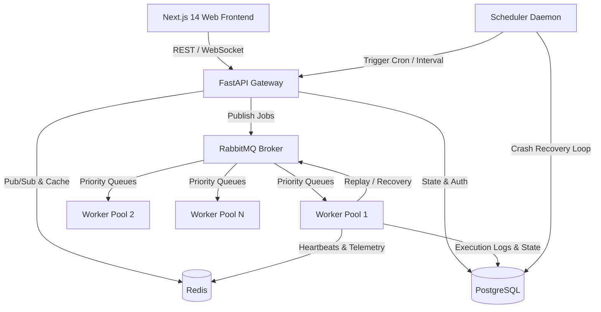

# FlowForge Architecture

## 1. High-Level Architecture
FlowForge is built as a distributed, fault-tolerant job execution and DAG workflow orchestration system.

## 2. Broker & Priority Queue Design
FlowForge leverages an AMQP 0-9-1 priority exchange topology with 4 distinct priority tiers:
1. `queue.critical` (Priority 10) - High-priority transactions and SLAs.
2. `queue.high` (Priority 7) - User-triggered asynchronous workflows.
3. `queue.normal` (Priority 4) - Standard background jobs.
4. `queue.low` (Priority 1) - Maintenance, cleanup, and batch aggregates.
5. `queue.dlq` - Dead Letter Queue with Dead Letter Exchange (`flowforge.dlx`) routing.
