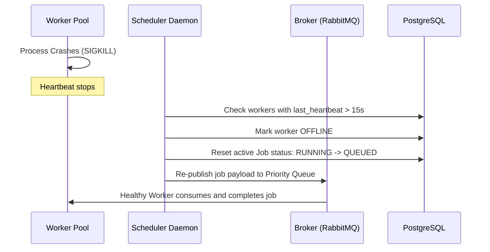

# FlowForge Failure Recovery & Chaos Lab

## 1. Failure Recovery Mechanics
FlowForge is designed with resilience at every layer:

## 2. Chaos Engineering Scenarios
- **Worker Termination:** Simulates sudden worker loss during execution.
- **Intentional Failure:** Stresses exponential retry backoff.
- **Queue Flooding:** Evaluates priority preemption under high load.
